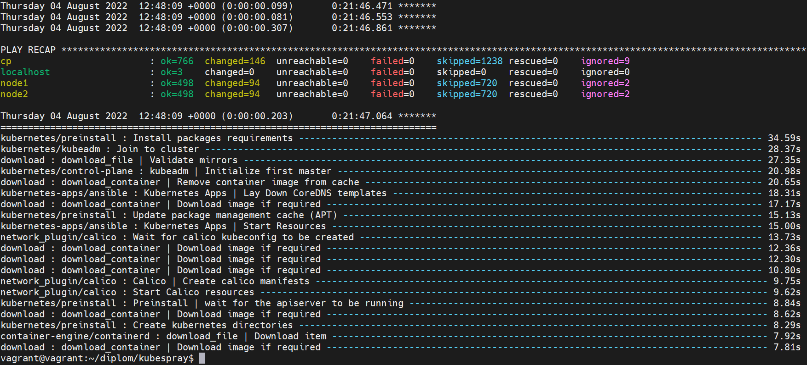
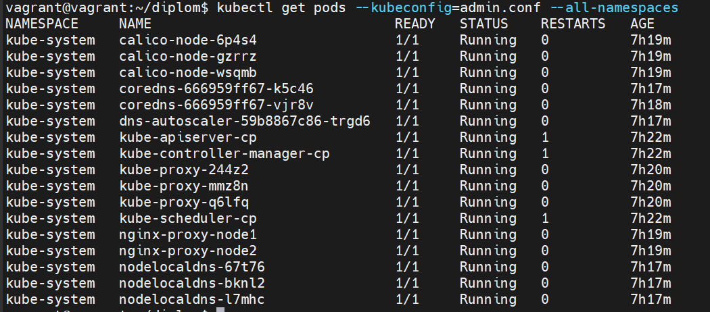

# Diploma_ND9-Kubespray
 
## Создание кластера Kubernetes с помощью Kubesparay.
Параметры кластера - файл [inventory.ini](https://github.com/Pitonixx/Diploma_ND9-Kubespray/blob/main/inventory/diploma/inventory.ini).

Для доступа ansible к нодам в файле inventory/diploma/group_vars/all/all.yml добавлен параметр "ansible_user", для которого в локальном профиле среды выполнения ansible-playbook созданы ssh-ключи, a публичный передан виртуальным машинам при создании инфраструктуры кластера.

Для доступа к созданному кластеру извне в файле inventory/diploma/group_vars/k8s_cluster/k8s-cluster.yml изменен параметр "supplementary_addresses_in_ssl_keys" - в этом поле добавлен внешний адрес control plane ноды. 
После создания кластера скопирован файл /etc/kubernetes/admin.conf с control plane node в локальный профиль среды выполнения kubectl и использован для доступа к подам.

Установка:
```shell
ansible-playbook -i inventory/diploma/inventory.ini cluster.yml -b -v
```



